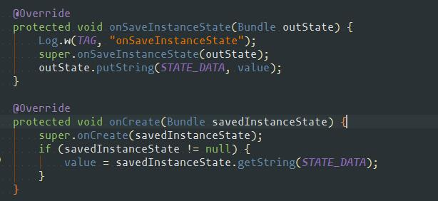

### activity生命周期
+ 启动
    + onCreate -> onStart -> onResume
+ 启动另一个activity2
    + onPause(1) -> onCreate(2) -> onStart(2) - onResume(2) -> onSaveInstanceState(1) -> onStop(1)
+ 再返回activity1
    + onPause(2) -> onRestart(1) -> onStart(1) -> onResume(1) -> onStop(2) -> onDestroy(2)
+ BACK键
    + onPause -> onSaveInstanceState -> onStop -> onDestory
+ HOME键
    + onPause -> onSaveInstanceState -> onStop
+ 再启动
    + onRestart -> onStart -> onResume
+ 长按HOME键，选择运行其他的程序
    + onPause -> onSaveInstanceState -> onStop
+ 锁屏
    + onPause -> onSaveInstanceState -> onStop
+ 解锁
    + onRestart -> onStart -> onResume
+ 横竖屏切换（不处理）
    + onPause -> onStop -> onDestory -> onCreate -> onStart -> onResume
+ 横竖屏切换 处理
    + android:configChanges="keyboardHidden|orientation|screenSize"
+ activity崩溃后生命周期
    + 崩溃activity的不执行生命周期 + onCreate -> onStart -> onRestoreInstanceState -> onResume
+ 设置 windowIsTranslucent 为true
    + onStop不会被调用

# onfinish 任务
+ Dismiss any dialogs the activity was managing
+ Close any cursors the activity was managing
+ Close any open search dialog

# onDestroy未正确执行 
+ handler有未处理完成的message
 
# activty销毁 static不会被销毁

# 如果activity崩溃后生命周期
+ 所有activity不执行onDestory，显示到的activity重新生命周期：onCreate -> onStart -> onRestoreInstanceState -> onResume

# 内存低数据需要存储数据
+ onSaveInstanceState存储
    + 数据需要持久化
        + SharedPreferences
        + 缓存
    + 数据不需要持久化
        